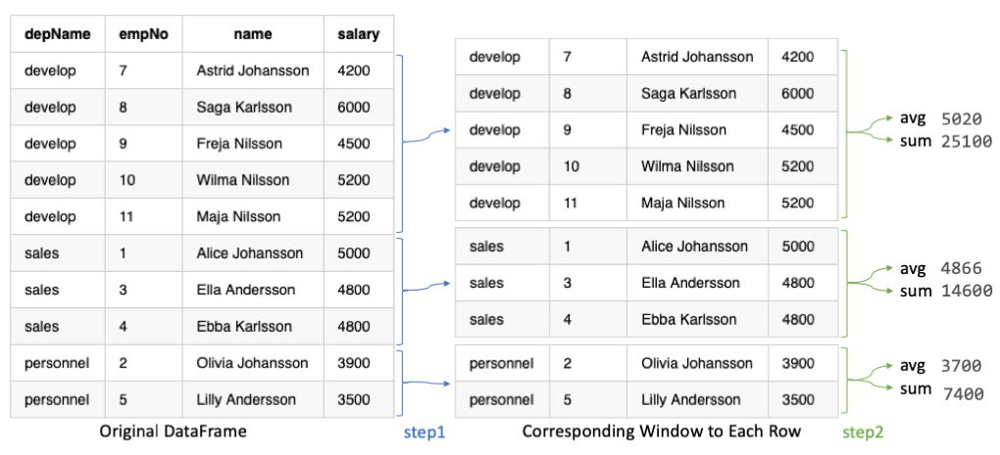

# Spark Window Function

**Window** (also, windowing or windowed) functions perform a calculation over a set of rows.
It is an important tool to do statistics. Most Databases support Window functions. Spark 1.4 start support Window functions. 

Spark Window Functions has following traits:

- perform a calculation over a group of rows
- a group of rows cooresponding to current row
- return new value to for each row by aggregate/window function
- Can use SQL grammer or DataFrame API.

Spark support multiple programming language as frontend. This article will only cover the usage of Window Functions with Scala DataFrame API. 
It is very similar for Python DataFrame API, except few grammar difference.

For the usage of Windows function with SQL API, please refer to normal SQL guide.

## Import all needed package

Few objects/classes will be used in the article. Just import them all here for simplicity.

import org.apache.spark.sql.expressions.Window
import org.apache.spark.sql.types._
import org.apache.spark.sql.functions._

## Sample Dataset

The sample dataset has 4 columns, 

- `depName`: 3 departments in total
- `empNo`: Identical number for each employees
- `salary`: Most employees have different salary. While some employees have same salary for some demo case.
- `hobby`: A list of hobbies. This is only used for some of demo.

Here is the sample dataset

|  depName|empNo|            name|salary|          hobby|
|:--------|:----|:---------------|:-----|:--------------|
|    sales|    1| Alice Johansson|  5000|    [game, ski]|
|personnel|    2|Olivia Johansson|  3900|    [game, ski]|
|    sales|    3|  Ella Andersson|  4800|   [skate, ski]|
|    sales|    4|   Ebba Karlsson|  4800|    [game, ski]|
|personnel|    5| Lilly Andersson|  3500|   [climb, ski]|
|  develop|    7|Astrid Johansson|  4200|    [game, ski]|
|  develop|    8|   Saga Karlsson|  6000|   [kajak, ski]|
|  develop|    9|   Freja Nilsson|  4500|  [game, kajak]|
|  develop|   10|   Wilma Nilsson|  5200|    [game, ski]|
|  develop|   11|    Maja Nilsson|  5200|[game, farming]|

The following code can be used to create the sample dataset

    case class Salary(depName: String, empNo: Long, name: String, salary: Long, hobby: Seq[String])
    val empsalary = Seq(
      Salary("sales", 1, "Alice Johansson", 5000, List("game", "ski")),
      Salary("personnel", 2, "Olivia Johansson", 3900, List("game", "ski")),
      Salary("sales", 3, "Ella Andersson", 4800, List("skate", "ski")),
      Salary("sales", 4, "Ebba Karlsson", 4800, List("game", "ski")),
      Salary("personnel", 5, "Lilly Andersson", 3500, List("climb", "ski")),
      Salary("develop", 7, "Astrid Johansson", 4200, List("game", "ski")),
      Salary("develop", 8, "Saga Karlsson", 6000, List("kajak", "ski")),
      Salary("develop", 9, "Freja Nilsson", 4500, List("game", "kajak")),
      Salary("develop", 10, "Wilma Nilsson", 5200, List("game", "ski")),
      Salary("develop", 11, "Maja Nilsson", 5200, List("game", "farming"))).toDS
    empsalary.show()

## Spark Functions

There are hundreds of [general spark functions](https://spark.apache.org/docs/latest/api/scala/index.html#org.apache.spark.sql.functions$) in which 
**Aggregate Functions** and |**Window Functions** categories are related to this case. 

| Category Name                  | Input                | Output                  | Example |
|:-------------------------------|:---------------------|:------------------------|:--------|
|**Aggregate Functions**         |a group of rows       |a single return value    |avg,count,collect_list
|**Window Functions - Ranking**  |a single row + Window |a single return value    |rank,denseRank,percentRank,ntile,rowNumber
|**Window Functions - Analytics**|a single row + Window |a single return value    |cumeDist,firstValue,lastValue,lag,lead

Other functions categories are NOT applicable for Spark Window. 

The following example using function `array_contains` which is in collection function category. 
Spark will throw out exception when run it.

    val overCategory = Window.partitionBy('depName)
    val df = empsalary.withColumn(
      "average_salary_in_dep", array_contains('hobby, "game") over overCategory).withColumn(
      "total_salary_in_dep", sum('salary) over overCategory)
    df.show()
    
## Basic Window with `partitionBy`

A basic Window has following traits.

- Create with `Window.partitionBy`
- On one or more columns
- Each row will have corresponding window to it
- The window will be same for row in the same with same partition. (**NOTE**: This will NOT be the case with **orderBy** Window)
- Aggregate/Window functions can be applied on each row+window to generate a value

In the example, in previous graph and the following code, we calcuate 

- using function `avg` to calcuate average salary in a department 
- using function `sum` to calcuate total salary in a department

Here is the sample code

	val overCategory = Window.partitionBy('depName)
	val df = empsalary.withColumn(
	  "salaries", collect_list('salary) over overCategory).withColumn(
	  "average_salary", (avg('salary) over overCategory).cast("int")).withColumn(
	  "total_salary", sum('salary) over overCategory).select(
	   "depName", "empNo", "name", "salary", "salaries", "average_salary", "total_salary")
	df.show(false)

Here is the output from previous sample code. 

|depName  |empNo|name            |salary|salaries                      |average_salary|total_salary|
|:--------|:----|:---------------|:-----|:-----------------------------|:-------------|:-----------|
|develop  |7    |Astrid Johansson|4200  |[4200, 6000, 4500, 5200, 5200]|5020          |25100       |
|develop  |8    |Saga Karlsson   |6000  |[4200, 6000, 4500, 5200, 5200]|5020          |25100       |
|develop  |9    |Freja Nilsson   |4500  |[4200, 6000, 4500, 5200, 5200]|5020          |25100       |
|develop  |10   |Wilma Nilsson   |5200  |[4200, 6000, 4500, 5200, 5200]|5020          |25100       |
|develop  |11   |Maja Nilsson    |5200  |[4200, 6000, 4500, 5200, 5200]|5020          |25100       |
|sales    |1    |Alice Johansson |5000  |[5000, 4800, 4800]            |4866          |14600       |
|sales    |3    |Ella Andersson  |4800  |[5000, 4800, 4800]            |4866          |14600       |
|sales    |4    |Ebba Karlsson   |4800  |[5000, 4800, 4800]            |4866          |14600       |
|personnel|2    |Olivia Johansson|3900  |[3900, 3500]                  |3700          |7400        |
|personnel|5    |Lilly Andersson |3500  |[3900, 3500]                  |3700          |7400        |

From the output we can see that column salaries by function `collect_list` has same values in a window.

## Ordered Window with `partitionBy` and `orderBy`

An ordered Window has following traits.

- Create with `Window.partitionBy` followed by `orderBy`
- On one or more columns
- Each row will have corresponding window to it
- The window will NOT be same for row in the same with same partition. It is a calculation for previous rows in the window.
- Aggregate/Window functions can be applied on each row+window to generate a value

Here is the sample code

	val overCategory = Window.partitionBy('depName).orderBy('salary desc)
	val df = empsalary.withColumn(
	  "salaries", collect_list('salary) over overCategory).withColumn(
	  "average_salary", (avg('salary) over overCategory).cast("int")).withColumn(
	  "total_salary", sum('salary) over overCategory).select(
	   "depName", "empNo", "name", "salary", "salaries", "average_salary", "total_salary")
	df.show(false)

Here is the output from previous sample code. 

|depName  |empNo|name            |salary|salaries                      |average_salary|total_salary|
|:--------|:----|:---------------|:-----|:-----------------------------|:-------------|:-----------|
|develop  |8    |Saga Karlsson   |6000  |[6000]                        |6000          |6000        |
|develop  |10   |Wilma Nilsson   |5200  |[6000, 5200, 5200]            |5466          |16400       |
|develop  |11   |Maja Nilsson    |5200  |[6000, 5200, 5200]            |5466          |16400       |
|develop  |9    |Freja Nilsson   |4500  |[6000, 5200, 5200, 4500]      |5225          |20900       |
|develop  |7    |Astrid Johansson|4200  |[6000, 5200, 5200, 4500, 4200]|5020          |25100       |
|sales    |1    |Alice Johansson |5000  |[5000]                        |5000          |5000        |
|sales    |3    |Ella Andersson  |4800  |[5000, 4800, 4800]            |4866          |14600       |
|sales    |4    |Ebba Karlsson   |4800  |[5000, 4800, 4800]            |4866          |14600       |
|personnel|2    |Olivia Johansson|3900  |[3900]                        |3900          |3900        |
|personnel|5    |Lilly Andersson |3500  |[3900, 3500]                  |3700          |7400        |

From the output we can see that column salaries by function `collect_list` does NOT have same values in a window. 
The values are only from `unboundedPreceding` until `currentRow`. 

The `average_salary` and `total_salary` are not over the whole department, but average and total for the salary higher or equal then `currentRow`'s salary.

## rank functions in a group

Here is a table of all the rank functions supported in Spark.

|function    |description(within a window partition)|note |
|:-----------|:-------------------------------------|:----|
|rank        |rank of rows                          |might have gap, rank will be 1 2 2 4 ..., if the second & third has same value, the forth row will take the rank 4, 3 will be jumped.
|dense_rank  |dense rank or rows                    |no gaps, values will be like 1 2 2 3 ..., it the second & third has same value, the forth row will take the rank 3. 
|row_number  |row number                            |sequential natual number, rank will be 1 2 3 4 ..., even if the second & third has same value.
|ntile       |ntile id                              |split partition to ntile, the first group in the window be tile 1, the second group will be tile 2, and so on.   
|percent_rank|(rank - 1)/(total_rows - 1)           |useful like take 20% top people, 0 0.25 0.25 ...

Here is the sample code 

	val overCategory = Window.partitionBy('depName).orderBy('salary desc)
	val df = empsalary.withColumn(
	  "salaries", collect_list('salary) over overCategory).withColumn(
	  "rank", rank() over overCategory).withColumn(
	  "dense_rank", dense_rank() over overCategory).withColumn(
	  "row_number", row_number() over overCategory).withColumn(
	  "ntile", ntile(3) over overCategory).withColumn(
	  "percent_rank", percent_rank() over overCategory).select(
	   "depName", "empNo", "name", "salary", "rank", "dense_rank", "row_number", "ntile", "percent_rank")
	df.show(false)

Here is the output from previous sample code. 

|depName  |empNo|name            |salary|rank|dense_rank|row_number|ntile|percent_rank|
|:--------|:----|:---------------|:-----|:---|:---------|:---------|:----|:-----------|
|develop  |8    |Saga Karlsson   |6000  |1   |1         |1         |1    |0.0         |
|develop  |10   |Wilma Nilsson   |5200  |2   |2         |2         |1    |0.25        |
|develop  |11   |Maja Nilsson    |5200  |2   |2         |3         |2    |0.25        |
|develop  |9    |Freja Nilsson   |4500  |4   |3         |4         |2    |0.75        |
|develop  |7    |Astrid Johansson|4200  |5   |4         |5         |3    |1.0         |
|sales    |1    |Alice Johansson |5000  |1   |1         |1         |1    |0.0         |
|sales    |3    |Ella Andersson  |4800  |2   |2         |2         |2    |0.5         |
|sales    |4    |Ebba Karlsson   |4800  |2   |2         |3         |3    |0.5         |
|personnel|2    |Olivia Johansson|3900  |1   |1         |1         |1    |0.0         |
|personnel|5    |Lilly Andersson |3500  |2   |2         |2         |2    |1.0         |

After using the rank function, we can easily filter to get the rows we want. 

The following example keep the top 2 employees salary wise, others have to go. 
On the sample dataset Wilma Nilsson, Maja Nilsson have same salary. 
Maja has to go according to order, unfortunately. 

	val overCategory = Window.partitionBy('depName).orderBy('salary desc)
	val df = empsalary.withColumn(
	  "row_number", row_number() over overCategory).filter(
      'row_number <= 2).select(
      "depName", "empNo", "name", "salary")
	df.show(false)

## lag & lead in a group

`lag` and `lead` can be used, when we want get relative result between rows.
The real values we get are depending on the order. 

`lag` means getting the value from previous row; `lead` means getting the value from next row.
 
The following example adding rows with lead and lag salary.

	val overCategory = Window.partitionBy('depname).orderBy('salary.desc)
	val df = empsalary.withColumn(
	  "lead", lead('salary, 1).over(overCategory)).withColumn(
	  "lag", lag('salary, 1).over(overCategory)).select(
	      "depName", "empNo", "name", "salary", "lead", "lag")
	df.show(false)
	
Here is the output from previous example

|depName  |empNo|name            |salary|lead|lag |
|:--------|:----|:---------------|:-----|:---|:---|
|develop  |8    |Saga Karlsson   |6000  |5200|**null**|
|develop  |10   |Wilma Nilsson   |5200  |5200|6000|
|develop  |11   |Maja Nilsson    |5200  |4500|5200|
|develop  |9    |Freja Nilsson   |4500  |4200|5200|
|develop  |7    |Astrid Johansson|4200  |**null**|4500|
|sales    |1    |Alice Johansson |5000  |4800|**null**|
|sales    |3    |Ella Andersson  |4800  |4800|5000|
|sales    |4    |Ebba Karlsson   |4800  |**null**|4800|
|personnel|2    |Olivia Johansson|3900  |3500|**null**|
|personnel|5    |Lilly Andersson |3500  |**null**|3900|

Notice from the output, the first row in a window with `lag` will have value **null**, and the last row in a window with `lead` will have value **null**

We can calculate the difference with `lead` and `lag`. While since either the first/last value will be **null**, so one of difference value will be **null**.

	val diff = df.withColumn(
	    "higher_than_next", 'salary - 'lead).withColumn(
	    "lower_than_previous", 'lag - 'salary)
	diff.show()

We can replace the value **null** after getting the difference. Or like this example, using `when` to calculate the difference, fill in a literal value, e.g 0.

	val diff = df.withColumn(
	  "higher_than_next", when('lead.isNull, 0).otherwise('salary - 'lead)).withColumn(
	  "lower_than_previous", when('lag.isNull, 0).otherwise('lag - 'salary))
	diff.show()
	
We can, after calculate the difference, find some ourliers which have huge salary gap. 
The following example take employees whose salary is double to the next employee.

	diff.filter('higher_than_next > (lit(2) * 'salary)).show(false)
	
	
## Running Total 

Running total means add everything up until the `currentRow`

Example code to calculate running total. 

	val overCategory = Window.partitionBy('depname).orderBy('salary desc)

	val running_total = empsalary.withColumn(
	  "rank", rank().over(overCategory)).withColumn(
	  "costs", sum('salary).over(overCategory)).select(
	  "depName", "empNo", "name", "salary", "rank", "costs")
	running_total.show(false)

Here is the output. 

|depName  |empNo|name            |salary|rank|costs|
|:--------|:----|:---------------|:-----|:---|:----|
|develop  |8    |Saga Karlsson   |6000  |1   |6000 |
|develop  |10   |Wilma Nilsson   |5200  |2   |16400|
|develop  |11   |Maja Nilsson    |5200  |2   |16400|
|develop  |9    |Freja Nilsson   |4500  |4   |20900|
|develop  |7    |Astrid Johansson|4200  |5   |25100|
|sales    |1    |Alice Johansson |5000  |1   |5000 |
|sales    |3    |Ella Andersson  |4800  |2   |14600|
|sales    |4    |Ebba Karlsson   |4800  |2   |14600|
|personnel|2    |Olivia Johansson|3900  |1   |3900 |
|personnel|5    |Lilly Andersson |3500  |2   |7400 |

Depending on the example behavior we want, we might get row_number first, then calculate the running total.  

	val overCategory = Window.partitionBy('depname).orderBy('salary desc)
    val overRowCategory = Window.partitionBy('depname).orderBy('row_number)

	val running_total = empsalary.withColumn(
	  "row_number", row_number() over overCategory).withColumn(
	  "costs", sum('salary) over overRowCategory).select(
	  "depName", "empNo", "name", "salary", "row_number", "costs")
	running_total.show(false)
	
	
## Range Window

We can use range functions to change frame boundary of a window. 
E.g. Depends on the dataset, window might goes extremely large, we can use 

- Create with `Window.partitionBy` followed by `rangeBetween` or `rowsBetween`
- It usually used after `orderBy` so that the data in the window is ordered.
- Each row will have corresponding window to it
- frame boundary is controlled by `rangeBetween` or `rowsBetween`
- Aggregate/Window functions can be applied on each row+window to generate a value

Here is an example use directly after `Window.partitionBy`. The data in the window is random.

	val overCategory = Window.partitionBy('depName).rowsBetween(
	  Window.currentRow, 1)
	val df = empsalary.withColumn(
	  "salaries", collect_list('salary) over overCategory).withColumn(
	  "total_salary", sum('salary) over overCategory)
	df.select("depName", "empNo", "name", "salary", "salaries", "total_salary").show(false)

The output from previous example

|depName  |empNo|name            |salary|salaries    |total_salary|
|:--------|:----|:---------------|:-----|:-----------|:-----------|
|develop  |7    |Astrid Johansson|4200  |[4200, 6000]|10200       |
|develop  |8    |Saga Karlsson   |6000  |[6000, 4500]|10500       |
|develop  |9    |Freja Nilsson   |4500  |[4500, 5200]|9700        |
|develop  |10   |Wilma Nilsson   |5200  |[5200, 5200]|10400       |
|develop  |11   |Maja Nilsson    |5200  |[5200]      |5200        |
|sales    |1    |Alice Johansson |5000  |[5000, 4800]|9800        |
|sales    |3    |Ella Andersson  |4800  |[4800, 4800]|9600        |
|sales    |4    |Ebba Karlsson   |4800  |[4800]      |4800        |
|personnel|2    |Olivia Johansson|3900  |[3900, 3500]|7400        |
|personnel|5    |Lilly Andersson |3500  |[3500]      |3500        |

Here is an example use after `Window.partitionBy` and `orderBy`. The data in the window is ordered.

	val overCategory = Window.partitionBy('depName).orderBy('salary desc).rowsBetween(
	   Window.currentRow, 1)
	val df = empsalary.withColumn(
	  "salaries", collect_list('salary) over overCategory).withColumn(
	  "total_salary", sum('salary) over overCategory)
	df.select("depName", "empNo", "name", "salary", "salaries", "total_salary").show(false)

The output from previous example

|depName  |empNo|name            |salary|salaries    |total_salary|
|:--------|:----|:---------------|:-----|:-----------|:-----------|
|develop  |8    |Saga Karlsson   |6000  |[6000, 5200]|11200       |
|develop  |10   |Wilma Nilsson   |5200  |[5200, 5200]|10400       |
|develop  |11   |Maja Nilsson    |5200  |[5200, 4500]|9700        |
|develop  |9    |Freja Nilsson   |4500  |[4500, 4200]|8700        |
|develop  |7    |Astrid Johansson|4200  |[4200]      |4200        |
|sales    |1    |Alice Johansson |5000  |[5000, 4800]|9800        |
|sales    |3    |Ella Andersson  |4800  |[4800, 4800]|9600        |
|sales    |4    |Ebba Karlsson   |4800  |[4800]      |4800        |
|personnel|2    |Olivia Johansson|3900  |[3900, 3500]|7400        |
|personnel|5    |Lilly Andersson |3500  |[3500]      |3500        |

## Median

`mean`(`avg`) and `median` are commonly used in statistics. In certain cases `median` are more robust compare to mean, since it will filter out outlier values.

|             | mean   | median |
|:------------|:-------|:-------|
| definition  | average value | middle value |
| advantage   | cheap to calculate | more robust for anormaly values |
| disadvantage| anormal value can have large effect | expensive to calcuate

We can either using Window function directly, or first calculate median value, then join back with orginal data frame.

### Use Window to calculate median

We can use window function to calculate median value. Here is an example

	val overCategory = Window.partitionBy('depName).orderBy('salary).rowsBetween(
	  Window.unboundedPreceding, Window.unboundedFollowing)
	
	val df = empsalary.withColumn(
	  "salaries", collect_list('salary) over overCategory).withColumn(
	  "median_salary", element_at('salaries, (size('salaries)/2 + 1).cast("int")))
	df.select("depName", "empNo", "name", "salary", "salaries", "median_salary").show(false)

The output from previous example

|depName  |empNo|name            |salary|salaries                      |median_salary|
|:--------|:----|:---------------|:-----|:-----------------------------|:------------|
|develop  |7    |Astrid Johansson|4200  |[4200, 4500, 5200, 5200, 6000]|5200         |
|develop  |9    |Freja Nilsson   |4500  |[4200, 4500, 5200, 5200, 6000]|5200         |
|develop  |10   |Wilma Nilsson   |5200  |[4200, 4500, 5200, 5200, 6000]|5200         |
|develop  |11   |Maja Nilsson    |5200  |[4200, 4500, 5200, 5200, 6000]|5200         |
|develop  |8    |Saga Karlsson   |6000  |[4200, 4500, 5200, 5200, 6000]|5200         |
|sales    |3    |Ella Andersson  |4800  |[4800, 4800, 5000]            |4800         |
|sales    |4    |Ebba Karlsson   |4800  |[4800, 4800, 5000]            |4800         |
|sales    |1    |Alice Johansson |5000  |[4800, 4800, 5000]            |4800         |
|personnel|5    |Lilly Andersson |3500  |[3500, 3900]                  |3900         |
|personnel|2    |Olivia Johansson|3900  |[3500, 3900]                  |3900         |

### Use groupBy then join back to calculate median value

We can calculate the median value first, then join back with original DataFrame. Here is an example

	val dfMedian = empsalary.groupBy("depName").agg(
	  sort_array(collect_list('salary)).as("salaries")).select(
	  'depName, 'salaries, element_at('salaries, (size('salaries)/2 + 1).cast("int")).as("median_salary"))
	val df = empsalary.join(broadcast(dfMedian), "depName").select(
	    "depName", "empNo", "name", "salary", "salaries", "median_salary")
	df.show(false)

The output from previous example. 

|depName  |empNo|name            |salary|salaries                      |median_salary|
|:--------|:----|:---------------|:-----|:-----------------------------|:------------|
|sales    |1    |Alice Johansson |5000  |[4800, 4800, 5000]            |4800         |
|personnel|2    |Olivia Johansson|3900  |[3500, 3900]                  |3900         |
|sales    |3    |Ella Andersson  |4800  |[4800, 4800, 5000]            |4800         |
|sales    |4    |Ebba Karlsson   |4800  |[4800, 4800, 5000]            |4800         |
|personnel|5    |Lilly Andersson |3500  |[3500, 3900]                  |3900         |
|develop  |7    |Astrid Johansson|4200  |[4200, 4500, 5200, 5200, 6000]|5200         |
|develop  |8    |Saga Karlsson   |6000  |[4200, 4500, 5200, 5200, 6000]|5200         |
|develop  |9    |Freja Nilsson   |4500  |[4200, 4500, 5200, 5200, 6000]|5200         |
|develop  |10   |Wilma Nilsson   |5200  |[4200, 4500, 5200, 5200, 6000]|5200         |
|develop  |11   |Maja Nilsson    |5200  |[4200, 4500, 5200, 5200, 6000]|5200         |